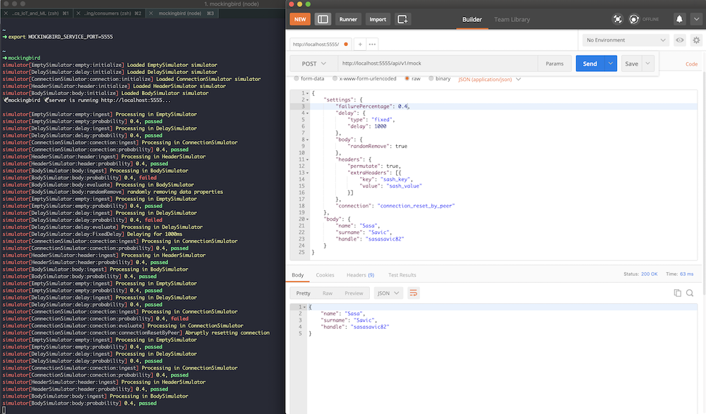
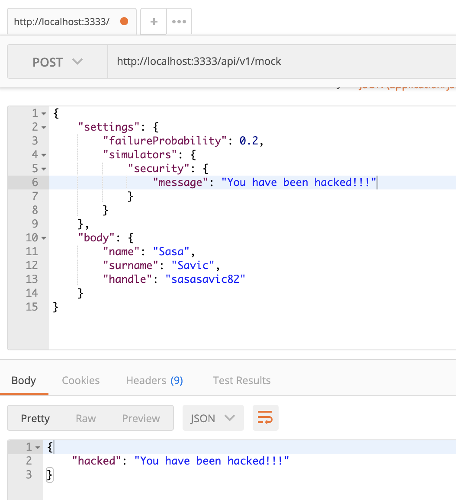

# Mockingbird

[](https://bestpractices.coreinfrastructure.org/projects/3335)


----

Mockingbird is an open source distributed and programmable fault simulation mocking service.

It provides an extensible set of middleware layers that enable the simulation of
variety of different service faults under load testing. The framework serves two primary purposes:

1. Allow consumers to test the way they handle services that exhibit uncertainty and
instability, under load.
2. Test the behaviour of proxy, load-balancing and API gateway layers (the infrastructure
that sits between the API providers and API consumers)

Mockingbird is built so that it can be used as an [NPM] package. It can also be
used as a stand-alone `cli` as well as part of a [Serverless] ecosystem by deploying
it using `serverless framework`.


Mockingbird is completely stateless, making it highly scalable. You can run it in one container
or a thousand 🤓 Being *programmable* means that with every request, you simply supply the kinds of simulations you'd
like to run against the request and the probability of failure occurence (`0.0 - 1.0`)

----
## How does it work

It's simple - you blast your Mockingbird service endpoint (i.e. `localhost:3333/api/v1/mock`) with a tonne of `POST` requests,
specifying a `body` payload and a `settings` payload.

```
curl -d "@data.json" -H "Content-Type: application/json" http://localhost:3333/api/v1/mock 
```

... `data.json` being:
```
{
	"body": ..., 
	"settings": ...
}
```

The `body` payload represents your normal HTTP resource representation data, while `settings` represents the simulation
settings you'd like to simulate with some level of uncertainty. For example, as part of the settings, you may specify
the probability of the fault occurence.

```{
	"body": ..., 
	"settings": {
		"failureProbability": 0.2,
		"simulators": {
			"connection": "connection_reset_by_peer"
		}
	}
}
```

The above example tells the Mockingbird service to cause a `connection_reset_by_peer` (and abrupt closure of the socket),
20% of the time


## Mockingbird is awesome
> This project is powered by github 🌟s ^ go ahead and [star it please](https://github.com/sasasavic82/mockingbird/stargazers).

> With great languages comes great responsibility!!!

### Why
There is a need for an open source fault simulation framework ... why not?

### Requirements

* NodeJS v10

## Get it up and running quickly

Get it (global installation):
```
npm install @imbueapp/mockingbird -g
```

Run it
```
mockingbird
```

Mockingbird runs on default port `3333`, but you can set a environmental variable `MOCKINGBIRD_SERVICE_PORT` to your desired port and then run `mockingbird` command.

```
export MOCKINGBIRD_SERVICE_PORT=5555
```

## Running the Mockingbird service and hitting Postman requests


## Mockingbird source layers
Mockingbird allows you to specify a `source layer` that enables loading simulation data from locations other than the `body` property.
Supported source types currently are `body`, `http` and `store`, which is a locally loaded `JSON` payload.


```
	"settings": {
		"failureProbability": 0.2,
		"source": {
			"type": "store",
			"settings": {
				"storeKey": "people",
				"query": "people[id=1]"
			}
		},
		"simulators": {
			"delay": {
				"type": "fixed",
				"delay": 1000
			}
		}
	},
	body: ...
```

### store source type settings
In the above example, we separate differet data via a storeKey. An example data, loaded in Mockingbird, may look like:

```
{
    "people": [
        {
            "id": 1,
            "name": "Joe",
            "surame": "Bloggs",
            "age": 35,
            "address": {
                "street": "666 Evil Street",
                "city": "Sydney"
            }
        },
        {
            "id": 2,
            "name": "Marry",
            "surame": "Jones",
            "age": 29,
            "address": {
                "street": "172 Cool Street",
                "city": "Brisbae"
            }
        }
    ],
    "payload": {
        "field1": "Field1",
        "field2": "Field2",
        "array": [
            "item1",
            "item2",
            "item3"
        ],
        "numerical": 10
    }
}
```

If we'd like to interrogate the `people`, we would supply `people` as the `storeKey` attribute, and query associated with the data.
We are using [JSONata] as the expression/query engine.

### http source type settings
In the below example, setup Mockingservice to proxy a HTTP call to another service, query the results and run them through the simulationn layer(s).
Below, we are setting the failure probability to 50% and running the queried response through a `body.randomRemove` simulator.

```
{
	"settings": {
		"failureProbability": 0.5,
		"source": {
			"type": "http",
			"settings": {
				"uri": "https://jsonplaceholder.typicode.com/todos/1"
			}
		},
		"simulators": {
			"body": {
				"randomRemove": true
			}
		}
	}
}
```

## Mockingbird simulation layers
Mockingbird comes with a number of simulation middleware layers. As HTTP requests are
traversed through the different layers, a probability of fault occurence is calculated.

You have the option to control the probability of failure, from `0.0` (no failure) to
`1.0` (absolute failure).

Below are the layers currently supported by the framework.

### Body fault simulation
A variety of simulations that attempt to permutate the original body, such that the response payload is different to the original.

```
{
	"settings": {
		"failureProbability": 0.2,
		"simulators": {
			"body": {
				"randomContentType": true,
				"randomRemove": true
			}
		}
	},
	"body": {
		"name": "Sasa",
		"surname": "Savic",
		"handle": "sasasavic82"
	}
}
```

#### Random content type
This layer introduces uncertainty by setting a random content type. As an example, an `application/json`
content type may be switched to `text/xml` or any number of other mime types.

Sometimes, services tend to respond with an arbitrary mime type. Generally this behaviour is exhibited in
legacy systems, where you may see `ebXML` or `SOAP`-like messages.

#### Random property remove
Randomly remove a property from an object or remove an item from an array. 

### Header fault simulation
HTTP headers let the client and the server pass additional information with an HTTP request or response. They
are an integral part of client-server communication and often convey important information about the client or
about the server.

They are also used as important routing mechanisms, particularly if services rely on the additional data that
you would not traditionally convey in the HTTP body.

```
{
	"settings": {
		"failureProbability": 0.2,
		"simulators": {
			"headers": {
				"injectRandom": true,
				"permutate": true,
				"extraHeaders": [{
					"key": "sash_key",
					"value": "sash_value"
				}]
			}
		}
	},
	"body": {
		"name": "Sasa",
		"surname": "Savic",
		"handle": "sasasavic82"
	}
}
```

#### Inject extra headers
Given *Mockingbird* has a programmable interface, you may specify additional headers as part of your request. If
this layer is executed (based on the fault probability), those additional headers will be injeted as part of
service's response.

You may use this to check the behaviour of proxy, load-balancing and API gateway layers and see if they tend to
strip off certain headers.

#### Inject random headers
Inject random and arbitrary headers in the response.

#### Permutate headers
Swap key/values of headers around, or change the value of an existing header.

### Delay fault simulation
Delay simulation layer is an extremely useful layer that allows you simulate various network and service computation
latencies.

#### Fixed delay
If the fixed delay simulation layer is executed, the response will be delayed by a fixed amount of time, supplied as
part of the simulation configuration.

Example below, delaying for `1000ms` (1 second)

```
{
	"settings": {
		"failureProbability": 0.2,
		"simulators": {
			"delay": {
				"type": "fixed",
				"delay": 1000
			}
		}
	},
	"body": {
		"name": "Sasa",
		"surname": "Savic",
		"handle": "sasasavic82"
	}
}
```

#### Uniform delay
**IN-PROGRESS**

A uniform distribution can be used for simulating a stable latency with a fixed amount of jitter. You define it via:

lower - Lower bound of the range, inclusive.
upper - Upper bound of the range, inclusive.

For instance, to simulate a stable latency of 20ms +/- 5ms, use lower = 15 and upper = 25.

```
{
	"settings": {
		"failureProbability": 0.2,
		"simulators": {
			"delay": {
				"type": "uniform",
				"lower": 15,
				"upper": 25
			}
		}
	},
	"body": {
		"name": "Sasa",
		"surname": "Savic",
		"handle": "sasasavic82"
	}
}
```

#### Lognormal delay
**IN-PROGRESS**

In addition to fixed delays, a delay can be sampled from a random distribution. This allows simulation of more specific downstream latencies, such as a long tail.

A lognormal distribution is a pretty good approximation of long tailed latencies centered on the 50th percentile. It takes two parameters:

median - The 50th percentile of latencies.
sigma - Standard deviation. The larger the value, the longer the tail.

```
{
	"settings": {
		"failureProbability": 0.2,
		"simulators": {
			"delay": {
				"type": "lognormal",
				"median": 95,
				"sigma": 0.1
			}
		}
	},
	"body": {
		"name": "Sasa",
		"surname": "Savic",
		"handle": "sasasavic82"
	}
}
```

#### Chunk dribble delay
**IN-PROGRESS**

Dribble your responses back in chunks. This is very useful when simulating slow networks and deterministic timeouts.

It takes two parameters:

numberOfChunks - how many chunks you want your response body divided up into
totalDuration - the total duration you want the response to take in milliseconds

```
{
	"settings": {
		"failureProbability": 0.2,
		"simulators": {
			"delay": {
				"type": "lognormal",
				"numberOfChunks": 50,
				"totalDuration": 3000
			}
		}
	},
	"body": {
		"name": "Sasa",
		"surname": "Savic",
		"handle": "sasasavic82"
	}
}
```

### Connection fault simulation
Sometimes you may want to simulate various connection faults

#### Connection reset by peer
Abruptly end an existing connection, not returning a status or a payload.

```
{
	"settings": {
		"failureProbability": 0.2,
		"simulators": {
        	"connection": "connection_reset_by_peer"
		}
	},
	"body": {
		"name": "Sasa",
		"surname": "Savic",
		"handle": "sasasavic82"
	}
}
```

#### Empty response
Abruptly end the connection with a 200 OK HTTP response, but don't provide a body.

```
{
	"settings": {
		"failureProbability": 0.2,
		"simulators": {
        	"connection": "empty_response"
		}
	},
	"body": {
		"name": "Sasa",
		"surname": "Savic",
		"handle": "sasasavic82"
	}
}
```

## To start using Mockingbird as a stand-alone cli
IN-PROGRESS

## To run Mockingbird as a Serverless app
IN-PROGRESS

## To start developing Mockingbird using the npm package

Developing with Mockingbird is easy, All you need to do is inclide the package 
in your `package.json` file by running:

```
npm install @imbueapp/mockingbird
```

Let's build a quick Mocking Server with a DelaySimulator layer. In your `index.ts` file, define the following:

```
import { MockingServer, MockingEngine, ServerConfig, DelaySimulator } from "@imbueapp/mockingbird";

let engine = new MockingEngine();

engine.loadSimulators([
  new DelaySimulator({ namespace: "delay"})]
);

let serverConfig: ServerConfig = {
    port: process.env.MOCKINGBIRD_SERVICE_PORT || 3333,
    debug: true,
    engine: engine    
}

let mockingServer = new MockingServer(serverConfig);

mockingServer.startService();
```

Once you compile your project and run it, this is the output you should see:
```
# node index.js
simulator[DelaySimulator:delay:initialize] loaded DelaySimulator simulator
🕊️ mockingbird 🕊️ server is running http://localhost:3333...
```

Now, let's make a request using the following `data.json` payload:
```
{
	"settings": {
		"failureProbability": 0.2,
		"simulators": {
			"delay": {
				"type": "fixed",
				"delay": 1000
			}
		}
	},
	"body": {
		"name": "Joe Blogs"
	}
}
```
Run our curl command ...
```
curl -d "@data.json" -H "Content-Type: application/json" http://localhost:3333/api/v1/mock 
```

And the output we should get:
```
simulator[DelaySimulator:delay:ingest] entering DelaySimulator simulator
simulator[DelaySimulator:delay:probability] probability of failure occured... simulating failure
simulator[DelaySimulator:delay:evaluate] processing DelaySimulator simulator
simulator[DelaySimulator:delay:FixedDelay] delaying for 5000ms
```

Your request should have been delayed by 5000ms (5 seconds). Mine did :) Running it multiple times should yield majority of your
request to be returned immediately and about 20% of them to be delayed, as dictated by the `"failureProbability": 0.2` property.
 
## Creating your own Simulation layer
Let's create a new simulation layer. Let that layer be a "security" layer, where we inject a `hacked` message into our response.


```
import { MockingServer, MockingEngine, ServerConfig, BaseSimulator, SimulatorContext, SimulationConfig } from "@imbueapp/mockingbird";

interface SecurityData {
  message: string
}

export class SecuritySimulator extends BaseSimulator<SecurityData> {
  constructor(config: SimulationConfig) {
      super(config);
      this.namespace = "security";
  }

  evaluate(context: SimulatorContext<SecurityData>): void {
      let securityMessage: string = context.settings.message
      context.res.status(200).send({
        "hacked": securityMessage
      });
  }
}

let engine = new MockingEngine();

engine.loadSimulators([
  new SecuritySimulator({ namespace: "security"})]
);

let serverConfig: ServerConfig = {
    port: process.env.MOCKINGBIRD_SERVICE_PORT || 3333,
    debug: true,
    engine: engine    
}

let mockingServer = new MockingServer(serverConfig);

mockingServer.startService();
```

### What did we do here?

1. We have defined an interface `SecurityData` that describes the configuration data associated with this new layer.
2. We create a new class `SecuritySimulator` and extend it with `BaseSimulator<SecurityData>`, passing in the type variable `SecurityData`. Internally, this will give our data representational visibility
3. The `BaseSimulator` is an abstract class, and it forces us to implement the  `evaluate(context: SimulatorContext<SecurityData>): void` method. This method will be called by
the parent class, `BaseSimulator` when running/evaluating the simulation.
4. Inside the `evaluate` method, we simply retrieve the `message` property (the one we defined in our `SecurityData` interface).
5. We finally respond back to our client with a `200 OK`, but augmenting the original payload to our message.
6. Once we initialize the `MockingEngine` and pass on an instance of our `SecuritySimulator` (making sure we provide the `namespace: "security"`).

NOTE: `namespace` provides scope resolution when we are parsing the request payload. Notice in our payload in the image below we have the following in the `settings` section:

```
	"settings": {
		"failureProbability": 0.4,
		"security": {
			"message": "You have been hacked!!!!!!"
		}
	}
```

The security property reflects the `namespace`.

Next version of Mockingbird will allow for extending of the namespaces.

### Let's run our new Simulation layer

Initializing the service will yield:

```
🕊️ mockingbird 🕊️ server is running http://localhost:3333...
simulator[SecuritySimulator:security:initialize] loaded SecuritySimulator simulator
```
And running the following payload against our running Mockingbird service will yield:



Pretty cool eh? :)

We should also see the following log output from the Mockingbird service Simulation engine:

```
simulator[SecuritySimulator:security:ingest] entering SecuritySimulator simulator
simulator[SecuritySimulator:security:probability] probability of failure occured... simulating failure
simulator[SecuritySimulator:security:evaluate] processing SecuritySimulator simulator
```

##### Running in docker.
Provided you have docker on your local machine :), run the following from the root directory of the project
```
docker build -t test/mockingbird .
docker run -it -p 3333:3333 test/mockingbird
```
What you will notice is the container will run mockingbird in cluster mode. This is defined in the `cluster.yml` We achieve clustering
via a very powerful package called `pm2-runtime` that solves major issues when running Node.js applications inside containers. To name a few:

* Second Process Fallback for High Application Reliability
* Process Flow Control
* Automatic Application Monitoring to keep it always sane and high performing
* Automatic Source Map Discovery and Resolving Support

## Securing Mockingbird

To configure Mockingbird as a secure server, specify the following environment variables:

```
MOCKINGBIRD_SERVER_CRT = <full path to server certificate PEM file>,
MOCKINGBIRD_SERVER_KEY = <full path to server key PEM file>,
```
and access the server using `https`:

```
curl -d "@data.json" -H "Content-Type: application/json" https://localhost:3333/api/v1/mock 
```

### Client Certificate Validation (MASSL/MATLS)
To configure Mockingbird to additionally validate client certificates against a CA, specify the 
following environment variable in addition to the previous two:

```
MOCKINGBIRD_SERVER_CA = <full path to server CA PEM file>
```

and specify the appropriate client certificate when accessing the server, e.g.:

```
curl -d "@data.json" -H "Content-Type: application/json" http://localhost:3333/api/v1/mock --cert <full path to client crt file> --key <full path to client key file>
```

## Support

For support, please please raise a support ticket :)


[NPM]: https://www.npmjs.com/
[Serverless]: https://serverless.com/
[LinkedIn]: https://www.linkedin.com/in/sasasavic/
[npm-image]: https://img.shields.io/badge/npm-v1.3.0-blue
[npm-url]: https://www.npmjs.com/package/@imbueapp/mockingbird
[JSONata]: http://docs.jsonata.org/
